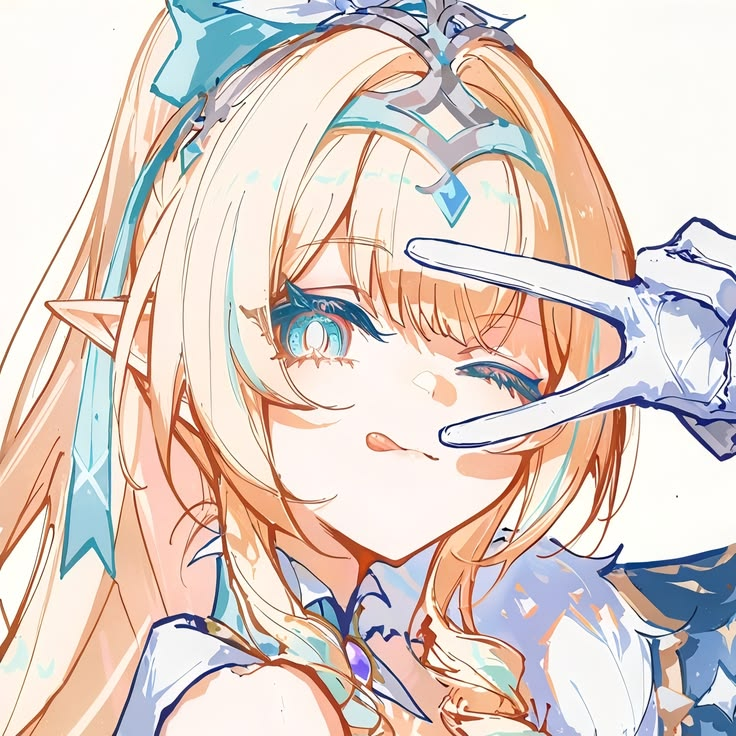

<!DOCTYPE html>
<html lang="vi">
<head>
<meta charset="UTF-8">
<meta name="viewport" content="width=device-width, initial-scale=1.0">
<title>Pompurin's Little World 🍮</title>

</head>

<body>

    

    

    

    

    

    

<!-- LOGIN -->

    

        
🍮

        <h2>Welcome!</h2>

        

            Chào mừng đến với 
            <b>Pompurin's Little World</b> ✨
        

        <input
            id="username"
            type="text"
            placeholder="Tên của bạn là gì? 🍪"
            maxlength="20"
        >

        <button class="enter" onclick="enterWorld()">
            ✨ Vào thế giới ✨
        </button>
    

<!-- TOP BAR -->
<header class="topbar">

    

        🍮 Pompurin
    

    

        

            🕐 --:--
        

        <button class="tool" onclick="toggleDark()">
            🌙
        </button>

    

</header>

<main class="container">

    <!-- HERO -->
    <section class="hero">

        

            

            

                Pompurin 🍮
            

            

                professional pudding enjoyer
            

            

                ● online & happy
            

        

        

            

                ✨ Welcome to my tiny world
            

            <h1>
                Hi, I'm Pompurin!
            </h1>

            

                Một chiếc profile nhỏ xinh dành cho một sinh vật
                thích pudding, ngủ, chơi game và làm mọi thứ
                theo cách hơi... lười một tí 🍮
            

            

                

                    🍮 Pudding lover
                

                

                    🎮 Gamer
                

                

                    💤 Sleep expert
                

                

                    ⭐ Lv. 99 Cute
                

            

        

    </section>

    <!-- MENU -->
    <section class="menu">

        <button onclick="openModal('about')">
            🍮
            About Me
        </button>

        <button onclick="openModal('friends')">
            👥
            Friends
        </button>

        <button onclick="openModal('hobbies')">
            🎮
            Hobbies
        </button>

        <button onclick="openModal('social')">
            💌
            Social
        </button>

    </section>

    <!-- WIDGETS -->
    <section class="widgets">

        

            <small>🕐 Local Time</small>
            

                --:--:--
            

            <small id="date">
                Loading...
            </small>
        

        

            <small>☁️ Weather</small>

            

                Loading...
            

            <small id="weatherDetail">
                Đang tìm thời tiết...
            </small>
        

    </section>

</main>

<!-- 3D MODAL -->

    

        <button class="close" onclick="closeModal()">
            ×
        </button>

        

    

</body>
</html>
